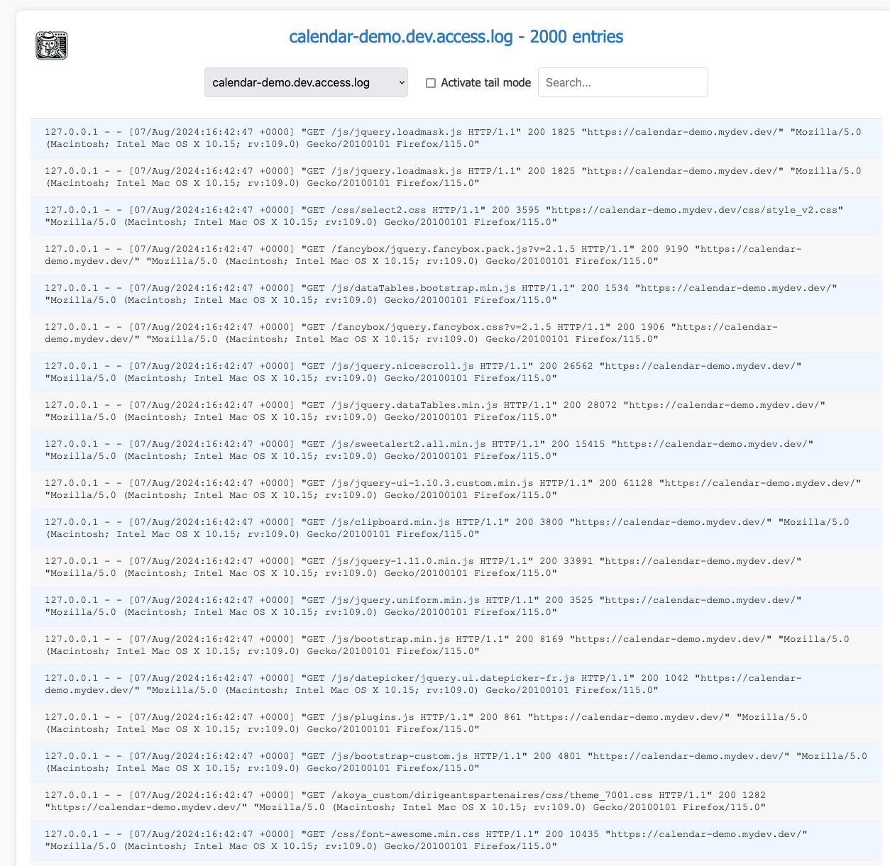
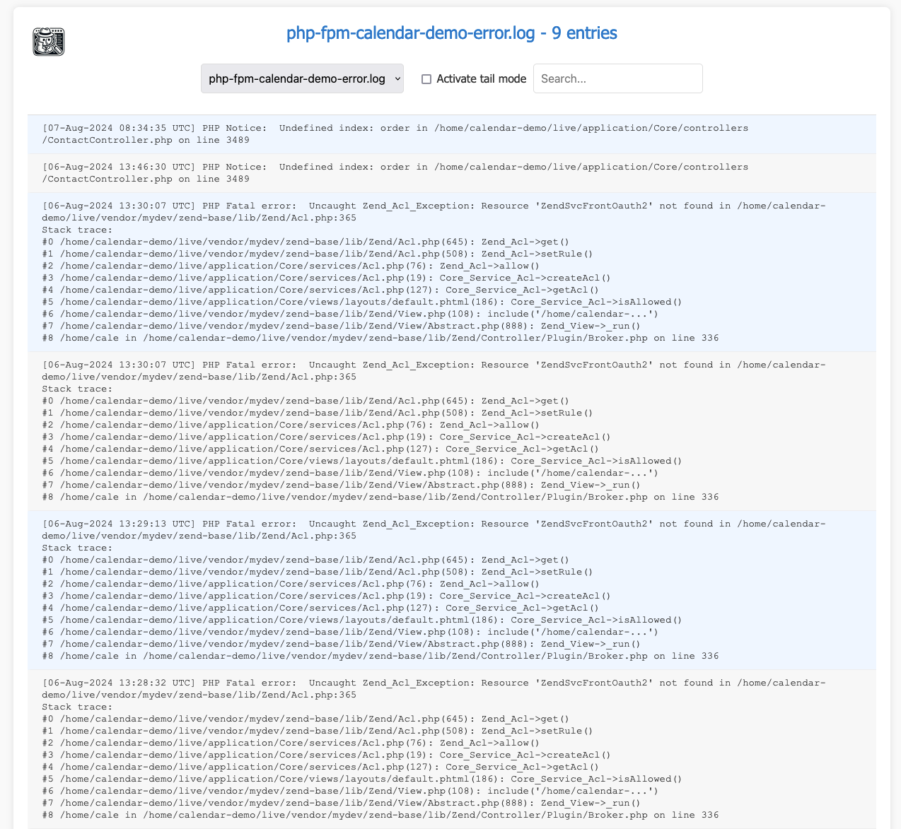
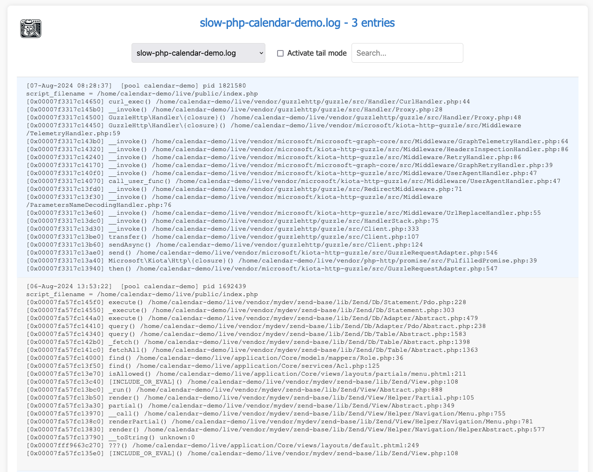

# SherLog - PHP Single File Log Analyzer

<table style="border-collapse: collapse; border: none;">
  <tr style="border: none;">
    <td style="border: none; vertical-align: top; padding: 0;">
      
    </td>
    <td style="border: none; vertical-align: top; padding: 0;">
      This project is a single file log analyzer written in PHP. It enables you to read various log formats including PHP-FPM error logs, PHP slow logs, Apache 2.4 {access|error} logs, nginx {access|error} logs. It is compatible with PHP 8 and uses a mask system that allows you to easily add new log types for interpretation.
    </td>
  </tr>
</table>


## Features

- **Single File Deployment**: Designed to be a single file for easy deployment. 
- **Log Formats Supported**: Out-of-the-box support for PHP-FPM error logs, PHP slow logs, Apache 2.4 {access|error} logs, nginx {access|error} logs.
- **Tail Mode**: Includes an auto-refresh feature, making it perfect for real-time debugging.
- **Search Box**: Quickly find specific entries in your logs.
- **PHP 8 Compatibility**: Fully compatible with PHP 8, ensuring modern PHP features and performance.
- **Maximum Log Entries**: Limits the number of log lines displayed to prevent the script from being overwhelmed (default: 2000 lines).
- **Password Protection:** Protects the script with a password to prevent unauthorized access.

## Log Format Patterns

The log analyzer uses regular expressions to identify different log formats. You can easily extend support for new log types by adding patterns to the `$logPatterns` array.

```php
$logPatterns = [
    'php-fpm' => '/^\[\d{2}-[A-Za-z]{3}-\d{4} \d{2}:\d{2}:\d{2} [A-Z]{3}\]/',
    'apache-access' => '/^\d{1,3}\.\d{1,3}\.\d{1,3}\.\d{1,3} - - \[\d{2}\/[A-Za-z]{3}\/\d{4}:\d{2}:\d{2}:\d{2} \+\d{4}\]/',
    'apache-error' => '/^\[[A-Za-z]{3} [A-Za-z]{3} \d{2} \d{2}:\d{2}:\d{2}\.\d{6} \d{4}\] \[[a-z]+:[a-z]+\]/',
    'slow-php' => '/^\[\d{2}-[A-Za-z]{3}-\d{4} \d{2}:\d{2}:\d{2}\]/'
];
```

## How to Use

1. **Deployment**: Simply upload the `sherlog.php` file to your server.
2. **Define Log Path:** Set the path to your log files. The script will add all files with the .log extension (i.e., \*.log) to the dropdown menu.
3. **Access**: Navigate to the file in your browser.
4. **Authentication**: Enter the configured password to access the log viewer.
5. **Select Log File**: Use the dropdown to select the log file you wish to view.
6. **Tail Mode**: Activate the auto-refresh mode to continuously update the log view in real-time.
7. **Search**: Use the search box to filter log entries and quickly find relevant information.

## Make it Permanent

Ensure that your log analysis capabilities remain in place even after production updates by integrating this tool into systems such as Apache's <Files> directive or Nginx's location directive. You can use a specific permanent path in your directives.

### Apache Configuration

To maintain log analysis capabilities in Apache, you can use the `<Files>` directive. This ensures that the configuration remains intact even after production updates. Here's an example configuration for Apache:

```apache
Alias /sherlog.php /home/$user/permanent/sherlog.php

<Directory /home/$user/permanent>
    Require all denied
    Require ip YOUR.IP.YOUR.IP
</Directory>
```

### Nginx Configuration

In Nginx, you can achieve similar functionality by using the `location` directive to restrict access to the log viewer file:

```nginx
    location /sherlog.php {
        alias /home/$user/permanent/sherlog.php;;
        allow YOUR.IP.YOUR.IP; 
        deny all;

        include fastcgi_params;
        fastcgi_pass unix:/var/run/php/php8.0-fpm.sock; # Adjust
        fastcgi_param SCRIPT_FILENAME /home/$user/permanent/sherlog.php;
    }
```

## Requirements

- PHP 8.0 or higher
- Web server (Apache, Nginx, etc.)

## Screenshots





## License

This project is licensed under the MIT License. See the [LICENSE](LICENSE) file for details.

